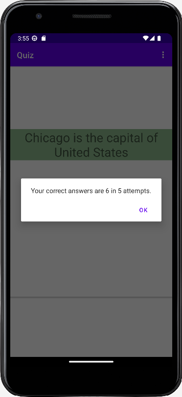

# Quiz Demo Android App using Java
- The Quiz App contains 10 True-False questions
- A toast will appear telling the user if the selected answer for any question was correct or incorrect
- The user could track the progress in the quiz using the progress bar. The progress bar will be updated to reflect the length of the quiz.
- When the quiz is finished, an alert dialog appears, showing the last attempt's results and asking the user to save the result or ignore them. When the save is clicked, the user can save the quiz attempt's result in the device's file system and when the ignore is clicked no storage will occur
- The UI and all other variables will be updated, preparing for another attempt
- The questions and colors will be shuffled after each attempt.
- In the App Menu: Get the Average - User can get the average number of correct answers in all attempts and Reset the Saved Results - All previous results in the file will be erased.
- The activity state must be saved when the device is rotated so the user can continue the quiz.
- The Quiz App also supports Urdu language

